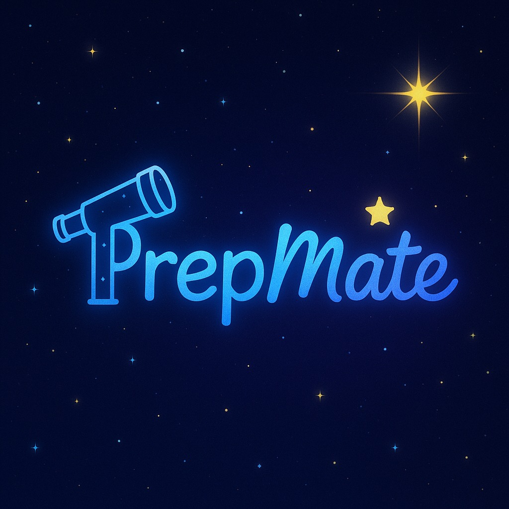
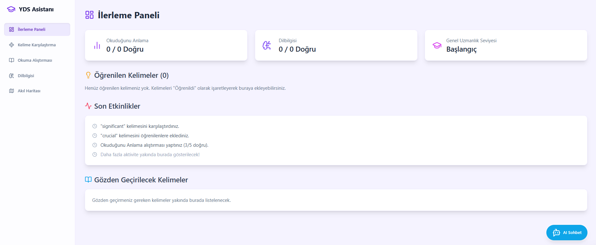
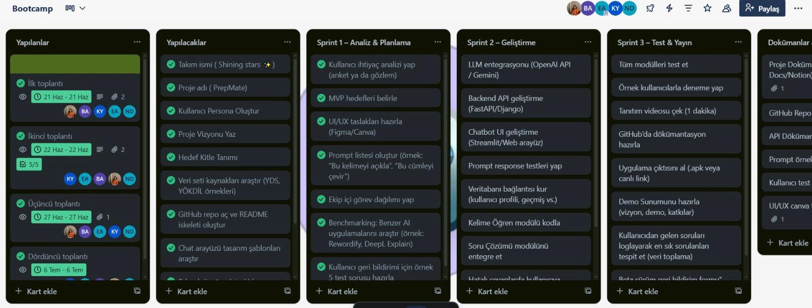
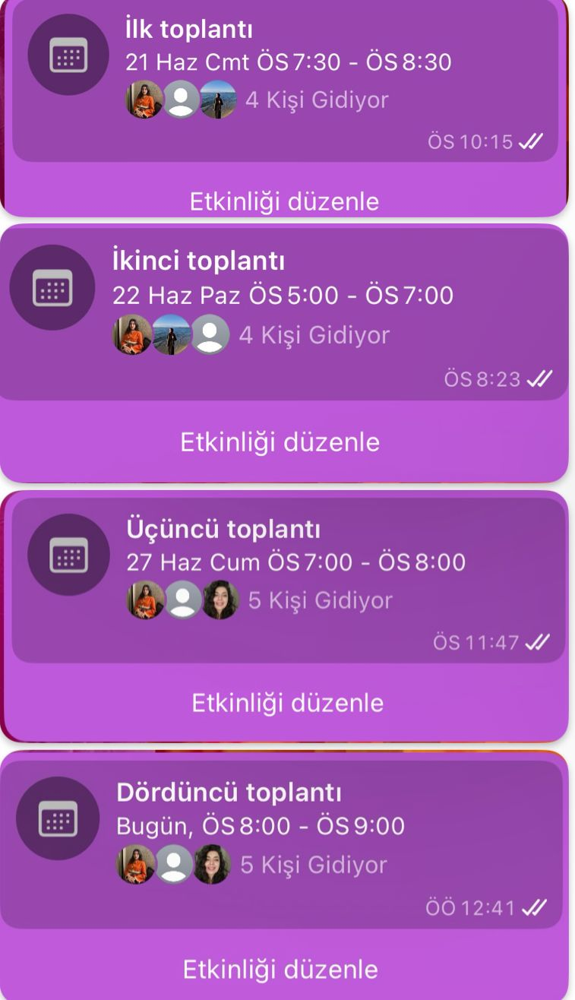
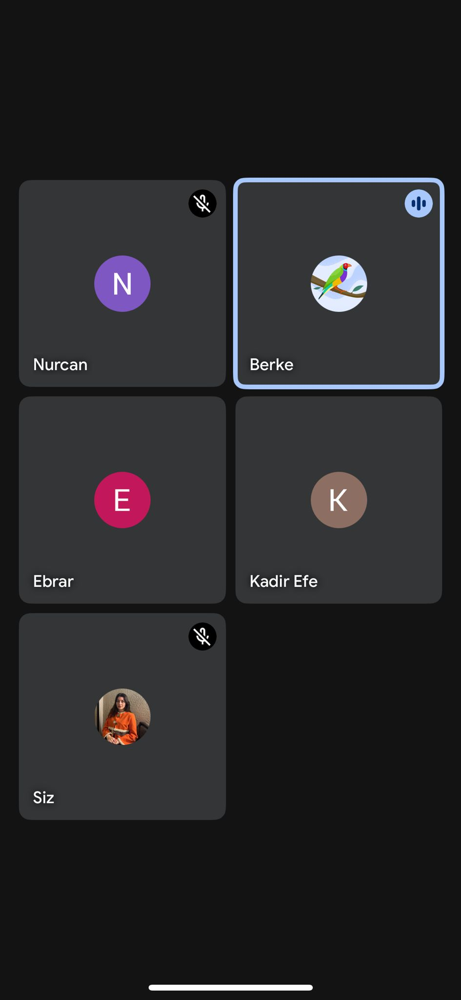
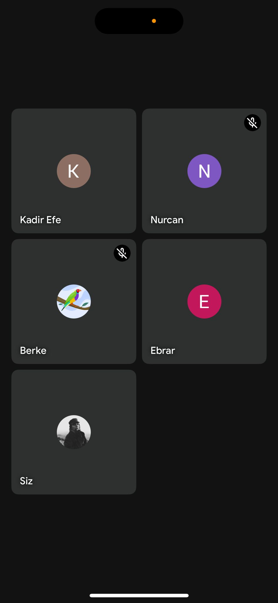
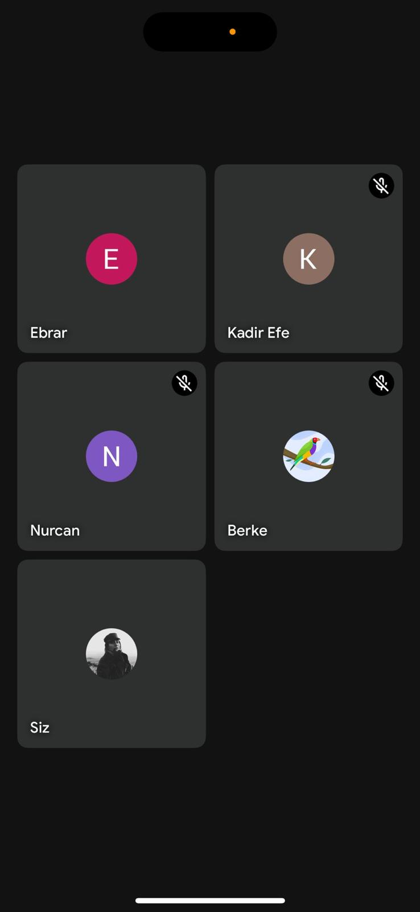
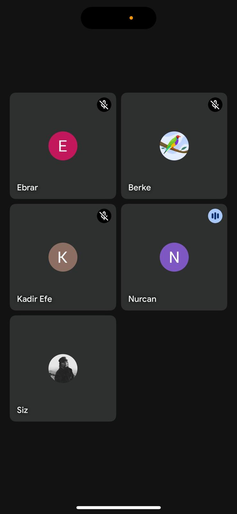

# AI-9YZTA-Bootcamp

## Takım İsmi
Shining Stars✨
## Takım Üyeleri
- ***Kadir Efe Yazılı*** 
- ***Ebral Karabulut*** 
- ***Muhammet Berke Ağaya***
- ***Ebrar Ağralı*** 
- ***Nurcan Düzkaya***

| Fotoğraf | İsim | Ünvan | Sosyal |
|:--------:|:-----:|:------:|:-------:|
|  | Kadir Efe Yazılı | Product Owner & Developer |  |
|  | Ebral Karabulut | Scrum Master |  |
|  | Muhammet Berke Ağaya | Developer |  |
|  | Ebrar Ağralı | Developer |  |
|  | Nurcan Düzkaya | Developer |  |

## Uygulama İsmi

## Uygulama Açıklaması
PrepMate, YDS ve YÖKDİL gibi önemli akademik İngilizce sınavlarına hazırlanan kullanıcıların tüm ihtiyaçlarını karşılayacak şekilde tasarlanmış kapsamlı ve yapay zekâ destekli bir çalışma arkadaşıdır.

Uygulama, kelime öğrenme, okuma ve dilbilgisi alıştırmaları, kişisel ilerleme takibi ve akıl haritası oluşturma gibi birçok fonksiyonla kullanıcıların öğrenme süreçlerini kolaylaştırır. Kullanıcılar günlük kelime tekrarları yapabilir, testler çözebilir ve gelişimlerini detaylı şekilde takip edebilirler. Ayrıca, yapay zekâ destekli sohbet modülü sayesinde İngilizce pratik yapmak ve öğrenme deneyimini zenginleştirmek mümkün olur.

Minimalist ve kullanıcı dostu arayüzü, mobil ve masaüstü cihazlarda sorunsuz bir deneyim sunar. PrepMate, akademik hedeflerinize ulaşmanız için size rehberlik eden, motive eden ve yol gösteren en güvenilir yardımcınızdır.

## Uygulama Özellikleri

- 📚 Günlük kelime tekrarları ve testler
- 🤖 AI destekli cümle açıklamaları ve çeviriler
- ✍️ YDS/YÖKDİL formatında deneme sınavları
- 🌌 Gökyüzü temalı takımyıldızı başarı sistemi
- 📈 Kişisel ilerleme paneli
- 🧩 Akademik deyim, bağlaç ve yapılarla gelişim

## Hedef Kitle
 •Üniversite öğrencileri
	•	YDS/YÖKDİL adayları
	•	Akademik İngilizce öğrenmek isteyen herkes

# Sprint Yol Haritamız

## İlk Sprint

### Kullanılan Teknolojiler
- **Frontend:** React.js, Tailwind CSS, React Markdown
- **API:** Google Gemini API
- **Backend & Hosting:** Firebase, Firebase API Key
- **Versiyon Kontrol & Deploy:** GitHub, GitHub Pages, GitHub Actions

### İlk Versiyonda Olacaklar
- Kelime öğretme modülü
- Prompt yanıtı veren LLM
- Gökyüzü temalı arayüz (takımyıldızları)
- Basit kullanıcı profili
- Personalar oluşturuldu
- Geri bildirim ekranı

Aşağıdaki tabloda, bu sprint içinde ele alınacak kullanıcı hikayeleri ve bunlara bağlı detaylı görevler yer almaktadır:

| Kullanıcı Hikayesi (User Story)                             | Görev (Task)                                                      | Tahmini Süre (Gün) | Puan (Story Point) | Sorumlu        | Durum     |
|------------------------------------------------------------|------------------------------------------------------------------|--------------------|--------------------|----------------|-----------|
| US1: Bir kullanıcı olarak, yeni kelimeler öğrenmek için günlük kelime setlerini görmek isterim. | T1.1: Kelime veri yapısını (Firestore) tanımlama.                | 1                  | 3                  | Backend Ekibi  | Başladı   |
|                                                            | T1.2: Firebase'e örnek kelime setleri yükleme.                   | 1                  | 3                  | Backend Ekibi  | Başladı   |
|                                                            | T1.3: Kelime kartlarını gösteren React bileşenini oluşturma.     | 2                  | 5                  | Frontend Ekibi | Başladı   |
|                                                            | T1.4: Kelime kartları için Tailwind CSS stilini uygulama.        | 1                  | 3                  | Frontend Ekibi | Başladı   |
|                                                            | T1.5: Kelime tekrar mekanizması için test arayüzü ekleme.        | 1                  | 3                  | Frontend Ekibi | Başladı   |
| US2: Bir kullanıcı olarak, zorlandığım kelimelerin AI tarafından açıklanmış cümle örneklerini görmek isterim. | T2.1: Google Gemini API entegrasyonu için servis katmanı oluşturma. | 2                | 8                  | Backend Ekibi  | Başladı   |
|                                                            | T2.2: Kullanıcının seçtiği kelime/cümleyi AI'a gönderme işlevi geliştirme. | 1             | 5                  | Frontend Ekibi | Başladı   |
|                                                            | T2.3: AI yanıtını gösterecek UI bileşenini tasarlama.             | 2                  | 5                  | Frontend Ekibi | Başladı   |
|                                                            | T2.4: AI yanıtlarının React Markdown ile düzgün görüntülenmesini sağlama. | 1              | 3                  | Frontend Ekibi | Başladı   |
| US3: Uygulamanın genel temasının gökyüzü ve takımyıldızları ile uyumlu olmasını isterim. | T3.1: Temel renk paletini ve fontları tanımlama (Tailwind config). | 0.5               | 2                  | UI/UX Tasarımcı | Tamamlandı|
|                                                            | T3.2: Ana sayfa arkaplanına gökyüzü temalı görsel/stil ekleme.    | 1                  | 3                  | Frontend Ekibi | Başladı   |
|                                                            | T3.3: Basit takımyıldızı başarı sistemi için placeholder UI oluşturma. | 1               | 3                  | Frontend Ekibi | Başladı   |
| US4: Basit bir kullanıcı profilim olsun isterim.           | T4.1: Kullanıcı profili veri yapısını tanımlama (Firestore).     | 1                  | 3                  | Backend Ekibi  | Başladı   |
|                                                            | T4.2: Basit kullanıcı profili ekranı oluşturma.                   | 1                  | 3                  | Frontend Ekibi | Başladı   |
| US5: Uygulama hakkında geri bildirimde bulunmak isterim.   | T5.1: Geri bildirim formu UI bileşenini oluşturma.                | 1                  | 3                  | Frontend Ekibi | Başladı   |
|                                                            | T5.2: Geri bildirimleri Firebase'e kaydetme işlevini geliştirme. | 1                  | 3                  | Backend Ekibi  | Başladı   |
| US6: Projenin yönetim süreçlerini ve altyapısını kurmak isterim. | T6.1: Personaların oluşturulması ve dokümantasyonu.             | 1                  | 3                  | Product Owner  | Tamamlandı|
|                                                            | T6.2: GitHub reposunu oluşturma ve ilk kod yapısını kurma.        | 0.5                | 2                  | Developer      | Tamamlandı|
|                                                            | T6.3: GitHub Pages ve Actions ile deploy altyapısını kurma.       | 1                  | 5                  | Developer      | Başladı   |
|                                                            | T6.4: Trello panosunu güncel tutma.                               | Sürekli            | -                  | Tüm Ekip       | Sürekli   |
|                                                            | T6.5: Günlük Scrum toplantılarını yapma.                          | Sürekli            | -                  | Tüm Ekip       | Sürekli   |
|                                                            | T6.6: Sprint sonu ekran görüntülerini alma ve dokümantasyona ekleme. | 0.5               | 1                  | Proje Yöneticisi | Planlandı |
|                                                            | T6.7: Sprint Review toplantısını planlama ve sunumu hazırlama.   | 1                  | 2                  | Scrum Master   | Planlandı |
|                                                            | T6.8: Sprint Retrospective toplantısını düzenleme.                | 1                  | 2                  | Scrum Master   | Planlandı |

---

# Sprint Notları

- UI tasarımlarında **Canva ve Figma** kullanılmasına karar verildi.
- Proje yönetim aracı olarak **Trello** tercih edildi.
- Daily scrum toplantıları **Whatsapp** ve **Google Meet** üzerinden takımın uygunluğuna göre yapıldı.
- Uygulamanın ana temasının **gökyüzü ve takımyıldızları** olması kararlaştırıldı.
- YDS/YÖKDİL odaklı akademik İngilizce kelimeler ve yapılar hedeflendi.

---

## Sprint İçinde Tamamlanması Beklenen Puan:

**350 Puan**

---

## Puan Tamamlama Mantığı:

Toplamda **1200 puanlık** bir hedef belirlendi.  
Birinci sprintte, fikir oturması, tasarımların yapılması ve API ekleme planlandığı için **350 puan** hedeflenmiştir ve tamamlanmıştır.  
İkinci sprintte, kod yazma çalışmalarına yoğunlaşılacağı için **400 puan** hedeflenmiştir.  
Üçüncü sprintte ise kalan görevlerin tamamlanması ve entegrasyon çalışmaları yapılacağından **450 puan** hedefi konulmuştur.

---

## Sprint Gözden Geçirilmesi:

- Takım olarak birçok toplantı yapıldı ve tüm toplantılar planlandığı şekilde tamamlandı.  
- Takım ismi, proje adı, kullanıcı persona ve hedef kitle tanımı oluşturuldu.  
- Veri seti kaynakları araştırıldı (YDS, YÖKDİL örnekleri).  
- GitHub reposu açıldı ve README iskeleti oluşturuldu.  
- Chat arayüzü tasarım şablonları araştırıldı.  
- Kullanılan teknoloji yığını (stack) kararlaştırıldı.  
- Prompt engineering için örnekler belirlendi.  
- MVP hedefleri netleştirildi ve ekip içi görev dağılımı yapıldı.  
- UI/UX taslakları Canva ve Figma kullanılarak hazırlandı.  
- Kullanıcı geri bildirimi için test soruları oluşturuldu.  
- Takım içi iş birliği ve iletişim verimli şekilde sürdürüldü.
- Uygulamanın farklı özellikler taşımasını istenildiği için önceliklendirme aşamasında karar vermek kolay olmadı.
- Kelime öğretme modülünün de ön plana çıkarılmasına karar verildi.
- Uygulama adı oylama ile seçildi.
- Bu süreçte proje yönetim yöntemi belirlendi, takım birbiriyle tanışmış oldu, ve diğer sprintlerde de kullanılmak üzere sistem oluşturuldu.
- Whatsapp grubunda günlük olarak toplantılarda ertesi gün görevleri konuşuldu.

---

## Daily Scrum

Proje yönetim sürecimizi Trello üzerinden takip ediyoruz:  
[🔗 Trello Board](https://trello.com/b/8fP9S0KF/bootcamp)

## Product Backlog URL

[Projeye Git](https://kadirefeyazili.github.io/YZTA-Bootcamp/)

---

## Sprint Gözden Geçirme Katılımcıları:

**Kadir Efe Yazılı**, **Ebral Karabulut**, **Muhammet Berke Ağaya**, **Ebrar Ağralı**, **Nurcan Düzkaya**

---

## Sprint Retrospektifi:

- Firebase kurulumu ve entegrasyonu başarılı oldu, ancak bazı veri modelleme kararları gözden geçirilebilir.
- AI API entegrasyonu beklenenden biraz daha fazla zaman aldı, bir sonraki sprintte benzer entegrasyonlar için daha detaylı planlama yapılmalı.
- Tüm ekip üyelerinin kod yazma sürecine erken dahil olması verimliliği artırdı.
- Uygulamaya açık tema eklenmesi ve günlük UI düzenlemesi bir sonraki sprintte önceliklendirilecek.
- Kullanıcı profili geliştirme, günlük planlayıcı ve takvim entegrasyonu, alışkanlık oluşturma/takip ve görev listesi/hatırlatıcı özellikleri bir sonraki sprintler için detaylandırılacak.
- Tüm ekip üyelerinin ikinci sprintte birlikte kod yazmasına karar verildi.
- Yapay zeka eklentisi için uygulamaya uygun ücretsiz Gemini API entegrasyonuna karar verildi.
- Günlük kısmı UI düzenlenmesine karar verildi.
- Kelime öğretme ve test modüllerinin tamamlanmasına karar verildi.
- Tüm görevler planlandığı şekilde başarıyla tamamlandı.
- Takım üyeleri görev dağılımını etkin yaptı ve iş birliği güçlüydü.
- Sprint sonunda planlanan hedeflerin tamamı gerçekleştirilmiş oldu.

  
Sprint 1 - App Screenshots

  
  

  
Sprint 1 - Sprint Board Update Screenshots

  
  

  
Toplantı Görselleri

  

    
    
    
    
    
  

---

## 📃 Proje Dokümanı

[🔗 Canva](https://www.canva.com/design/DAGr9V-hQBg/k5EpeSP5GUWiXgXTwk_Thw/edit)
