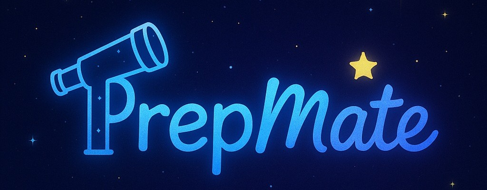

# AI-9YZTA-Bootcamp

## Takım İsmi
Shining Stars✨
## Takım Üyeleri
- ***Kadir Efe Yazılı*** 
- ***Ebral Karabulut*** 
- ***Muhammet Berke Ağaya***
- ***Ebrar Ağralı*** 
- ***Nurcan Düzkaya***

| Fotoğraf | İsim | Ünvan | Sosyal |
|:--------:|:-----:|:------:|:-------:|
|  | Kadir Efe Yazılı | Product Owner & Developer |  |
|  | Ebral Karabulut | Scrum Master |  |
|  | Muhammet Berke Ağaya | Developer |  |
|  | Ebrar Ağralı | Developer |  |
|  | Nurcan Düzkaya | Developer |  |

## Uygulama İsmi

## ⭐ **PrepMate:** *Akıllı Hazırlık, Parlayan Gelecek*

<h2>Uygulama Açıklaması</h2>

PrepMate, YDS ve YÖKDİL gibi önemli akademik İngilizce sınavlarına hazırlanan kullanıcıların tüm ihtiyaçlarını karşılayacak şekilde tasarlanmış kapsamlı ve yapay zekâ destekli bir çalışma arkadaşıdır.

Uygulama, kelime öğrenme, okuma ve dilbilgisi alıştırmaları, kişisel ilerleme takibi ve akıl haritası oluşturma gibi birçok fonksiyonla kullanıcıların öğrenme süreçlerini kolaylaştırır. Kullanıcılar günlük kelime tekrarları yapabilir, testler çözebilir ve gelişimlerini detaylı şekilde takip edebilirler. Ayrıca, yapay zekâ destekli sohbet modülü sayesinde İngilizce pratik yapmak ve öğrenme deneyimini zenginleştirmek mümkün olur.

Minimalist ve kullanıcı dostu arayüzü, mobil ve masaüstü cihazlarda sorunsuz bir deneyim sunar. PrepMate, akademik hedeflerinize ulaşmanız için size rehberlik eden, motive eden ve yol gösteren en güvenilir yardımcınızdır.

Sıkça Sorulan Sorular: [SSS](https://github.com/KadirEfeYazili/YZTA-Bootcamp/blob/main/ProjectManagementFiles/General_Documents/SSS_Turkce.pdf "PrepMate Kullanıcı Personaları")

  
<h4>English explanation</h4>

PrepMate is a comprehensive and AI-powered study companion designed to meet all the needs of users preparing for important academic English exams such as YDS and YÖKDİL.

The app facilitates the learning process with many features including vocabulary learning, reading and grammar exercises, personal progress tracking, and mind mapping. Users can review daily vocabulary, take tests, and monitor their progress in detail. Additionally, the AI-powered chat module allows users to practice English and enrich their learning experience.

With its minimalist and user-friendly interface, PrepMate offers a seamless experience on both mobile and desktop devices. PrepMate is your most reliable assistant, guiding, motivating, and supporting you to achieve your academic goals.

Frequently Asked Questions: [FAQ](https://github.com/KadirEfeYazili/YZTA-Bootcamp/blob/main/ProjectManagementFiles/General_Documents/FAQ_English.pdf "PrepMate Kullanıcı Personaları")

---

  
<h2>Uygulama Özellikleri</h2>

- 📚 Günlük kelime tekrarları ve kapsamlı testler ile etkin öğrenme  
- 🤖 Yapay zekâ destekli cümle açıklamaları ve anında çeviri imkanı  
- ✍️ YDS ve YÖKDİL formatlarına uygun deneme sınavları  
- 🌌 Gökyüzü temalı takımyıldızı başarı sistemi ile motive edici öğrenme deneyimi  
- 📈 Kişisel ilerleme paneli sayesinde detaylı performans takibi  
- 🧩 Akademik deyimler, bağlaçlar ve dil yapılarıyla dil becerilerinin geliştirilmesi  
- 🌟 Zengin ve çeşitli öğrenme materyalleri  
- 📱💻 Telefon, tablet ve bilgisayar gibi tüm cihazlarda uyumlu, kesintisiz kullanım  
- 🌍 Her zaman, her yerde öğrenme imkânı — internet bağlantısı olan her ortamda erişilebilir

  
<h4>English explanation</h4>

- 📚 Effective learning with daily vocabulary reviews and comprehensive tests  
- 🤖 AI-powered sentence explanations and instant translation capabilities  
- ✍️ Practice exams formatted for YDS and YÖKDİL standards  
- 🌌 Motivating learning experience with a sky-themed constellation achievement system  
- 📈 Detailed performance tracking via personal progress dashboard  
- 🧩 Development of language skills using academic idioms, conjunctions, and structures  
- 🌟 Rich and diverse learning materials  
- 📱💻 Compatible with all devices including phones, tablets, and computers for seamless usage  
- 🌍 Learn anytime, anywhere — accessible wherever there is internet connectivity  

## Hedef Kitle
- Üniversite öğrencileri
- YDS/YÖKDİL adayları
- İngilizce öğrenmek isteyen herkes

  
<h3>Kullanıcı Personaları</h3>

- 🤖[Türkçe Personalar](https://github.com/KadirEfeYazili/YZTA-Bootcamp/blob/main/ProjectManagementFiles/General_Documents/Persona_Turkce(1).pdf "PrepMate Kullanıcı Personaları")

- 🤖[English Personalities](https://github.com/KadirEfeYazili/YZTA-Bootcamp/blob/main/ProjectManagementFiles/General_Documents/Persona_English.pdf "PrepMate Kullanıcı Personaları")

  
<h2>Lean Canvas</h2>

  <h3>Business Model Canvas Poster</h3>

  

---

# Sprint Yol Haritalarımız

  
<h2>İlk Sprint</h2>

### Kullanılan Teknolojiler
- **Frontend:** React.js, Tailwind CSS, React Markdown
- **API:** Google Gemini API
- **Backend & Hosting:** Firebase, Firebase API Key
- **Versiyon Kontrol & Deploy:** GitHub, GitHub Pages, GitHub Actions

### İlk Versiyonda Olacaklar
- Kelime öğretme modülü
- Prompt yanıtı veren LLM
- Gökyüzü temalı arayüz (takımyıldızları)
- Basit kullanıcı profili
- Personalar oluşturuldu
- Geri bildirim ekranı

Aşağıdaki tabloda, bu sprint içinde ele alınacak kullanıcı hikayeleri ve bunlara bağlı detaylı görevler yer almaktadır:

| Görev (Task)                                                      | Tahmini Süre (Gün) | Puan (Story Point) | Sorumlu        | Durum     |
|------------------------------------------------------------------|--------------------|--------------------|----------------|-----------|
| T1.1: Kelime veri yapısını (Firestore) tanımlama.                | 1                  | 3                  | Backend Ekibi  | Başladı   |
| T1.2: Firebase'e örnek kelime setleri yükleme.                   | 1                  | 3                  | Backend Ekibi  | Başladı   |
| T1.3: Kelime kartlarını gösteren React bileşenini oluşturma.     | 2                  | 5                  | Frontend Ekibi | Başladı   |
| T1.4: Kelime kartları için Tailwind CSS stilini uygulama.        | 1                  | 3                  | Frontend Ekibi | Başladı   |
| T1.5: Kelime tekrar mekanizması için test arayüzü ekleme.        | 1                  | 3                  | Frontend Ekibi | Başladı   |
| T2.1: Google Gemini API entegrasyonu için servis katmanı oluşturma. | 2                | 8                  | Backend Ekibi  | Başladı   |
| T2.2: Kullanıcının seçtiği kelime/cümleyi AI'a gönderme işlevi geliştirme. | 1             | 5                  | Frontend Ekibi | Başladı   |
| T2.3: AI yanıtını gösterecek UI bileşenini tasarlama.             | 2                  | 5                  | Frontend Ekibi | Başladı   |
| T2.4: AI yanıtlarının React Markdown ile düzgün görüntülenmesini sağlama. | 1              | 3                  | Frontend Ekibi | Başladı   |
| T3.1: Temel renk paletini ve fontları tanımlama (Tailwind config). | 0.5               | 2                  | UI/UX Tasarımcı | Tamamlandı|
| T3.2: Ana sayfa arkaplanına gökyüzü temalı görsel/stil ekleme.    | 1                  | 3                  | Frontend Ekibi | Başladı   |
| T3.3: Basit takımyıldızı başarı sistemi için placeholder UI oluşturma. | 1               | 3                  | Frontend Ekibi | Başladı   |
| T4.1: Kullanıcı profili veri yapısını tanımlama (Firestore).     | 1                  | 3                  | Backend Ekibi  | Başladı   |
| T4.2: Basit kullanıcı profili ekranı oluşturma.                   | 1                  | 3                  | Frontend Ekibi | Başladı   |
| T5.1: Geri bildirim formu UI bileşenini oluşturma.                | 1                  | 3                  | Frontend Ekibi | Başladı   |
| T5.2: Geri bildirimleri Firebase'e kaydetme işlevini geliştirme. | 1                  | 3                  | Backend Ekibi  | Başladı   |
| T6.1: Personaların oluşturulması ve dokümantasyonu.             | 1                  | 3                  | Product Owner  | Tamamlandı|
| T6.2: GitHub reposunu oluşturma ve ilk kod yapısını kurma.        | 0.5                | 2                  | Developer      | Tamamlandı|
| T6.3: GitHub Pages ve Actions ile deploy altyapısını kurma.       | 1                  | 5                  | Developer      | Başladı   |
| T6.4: Trello panosunu güncel tutma.                               | Sürekli            | -                  | Tüm Ekip       | Sürekli   |
| T6.5: Günlük Scrum toplantılarını yapma.                          | Sürekli            | -                  | Tüm Ekip       | Sürekli   |
| T6.6: Sprint sonu ekran görüntülerini alma ve dokümantasyona ekleme. | 0.5               | 1                  | Proje Yöneticisi | Planlandı |
| T6.7: Sprint Review toplantısını planlama ve sunumu hazırlama.   | 1                  | 2                  | Scrum Master   | Planlandı |
| T6.8: Sprint Retrospective toplantısını düzenleme.                | 1                  | 2                  | Scrum Master   | Planlandı |

---

# Sprint Notları

- UI tasarımlarında **Canva ve Figma** kullanılmasına karar verildi.
- Proje yönetim aracı olarak **Trello** tercih edildi.
- Daily scrum toplantıları **Whatsapp** ve **Google Meet** üzerinden takımın uygunluğuna göre yapıldı.
- Uygulamanın ana temasının **gökyüzü ve takımyıldızları** olması kararlaştırıldı.
- YDS/YÖKDİL odaklı akademik İngilizce kelimeler ve yapılar hedeflendi.

---

## Sprint İçinde Tamamlanması Beklenen Puan:

**350 Puan**

---

## Puan Tamamlama Mantığı:

Toplamda **1200 puanlık** bir hedef belirlendi.  
Birinci sprintte, fikir oturması, tasarımların yapılması ve API ekleme planlandığı için **350 puan** hedeflenmiştir ve tamamlanmıştır.  
İkinci sprintte, kod yazma çalışmalarına yoğunlaşılacağı için **400 puan** hedeflenmiştir.  
Üçüncü sprintte ise kalan görevlerin tamamlanması ve entegrasyon çalışmaları yapılacağından **450 puan** hedefi konulmuştur.

---

## Sprint Gözden Geçirilmesi:

- Takım olarak birçok toplantı yapıldı ve tüm toplantılar planlandığı şekilde tamamlandı.  
- Takım ismi, proje adı, kullanıcı persona ve hedef kitle tanımı oluşturuldu.  
- Veri seti kaynakları araştırıldı (YDS, YÖKDİL örnekleri).  
- GitHub reposu açıldı ve README iskeleti oluşturuldu.  
- Chat arayüzü tasarım şablonları araştırıldı.  
- Kullanılan teknoloji yığını (stack) kararlaştırıldı.  
- Prompt engineering için örnekler belirlendi.  
- MVP hedefleri netleştirildi ve ekip içi görev dağılımı yapıldı.  
- UI/UX taslakları Canva ve Figma kullanılarak hazırlandı.  
- Kullanıcı geri bildirimi için test soruları oluşturuldu.  
- Takım içi iş birliği ve iletişim verimli şekilde sürdürüldü.
- Uygulamanın farklı özellikler taşımasını istenildiği için önceliklendirme aşamasında karar vermek kolay olmadı.
- Kelime öğretme modülünün de ön plana çıkarılmasına karar verildi.
- Uygulama adı oylama ile seçildi.
- Bu süreçte proje yönetim yöntemi belirlendi, takım birbiriyle tanışmış oldu, ve diğer sprintlerde de kullanılmak üzere sistem oluşturuldu.
- Whatsapp grubunda günlük olarak toplantılarda ertesi gün görevleri konuşuldu.

---

## Sprint Gözden Geçirme Katılımcıları:

**Kadir Efe Yazılı**, **Ebral Karabulut**, **Muhammet Berke Ağaya**, **Ebrar Ağralı**, **Nurcan Düzkaya**

---

## Sprint Retrospektifi:

- Firebase kurulumu ve entegrasyonu başarılı oldu, ancak bazı veri modelleme kararları gözden geçirilebilir.
- AI API entegrasyonu beklenenden biraz daha fazla zaman aldı, bir sonraki sprintte benzer entegrasyonlar için daha detaylı planlama yapılmalı.
- Tüm ekip üyelerinin kod yazma sürecine erken dahil olması verimliliği artırdı.
- Uygulamaya açık tema eklenmesi ve günlük UI düzenlemesi bir sonraki sprintte önceliklendirilecek.
- Kullanıcı profili geliştirme, günlük planlayıcı ve takvim entegrasyonu, alışkanlık oluşturma/takip ve görev listesi/hatırlatıcı özellikleri bir sonraki sprintler için detaylandırılacak.
- Tüm ekip üyelerinin ikinci sprintte birlikte kod yazmasına karar verildi.
- Yapay zeka eklentisi için uygulamaya uygun ücretsiz Gemini API entegrasyonuna karar verildi.
- Günlük kısmı UI düzenlenmesine karar verildi.
- Kelime öğretme ve test modüllerinin tamamlanmasına karar verildi.
- Tüm görevler planlandığı şekilde başarıyla tamamlandı.
- Takım üyeleri görev dağılımını etkin yaptı ve iş birliği güçlüydü.
- Sprint sonunda planlanan hedeflerin tamamı gerçekleştirilmiş oldu.

  
Sprint 1 - App Screenshots

  

  
Sprint 1 - Sprint Board Update Screenshots

  

  
Toplantı Görselleri

  

  
  

  
<h2>İkinci Sprint</h2>

---

## Kullanılan Teknolojiler

* **Frontend:** React.js, Tailwind CSS, React Markdown

* **API:** Google Gemini API

* **Backend & Hosting:** Firebase, Firebase API Key

* **Versiyon Kontrol & Deploy:** GitHub, GitHub Pages, GitHub Actions
---
## İkinci Versiyonda Olacaklar

* Kullanıcı profili geliştirme ve detaylandırma

* Günlük planlayıcı ve takvim entegrasyonu

* Alışkanlık oluşturma/takip modülü

* Görev listesi/hatırlatıcı özellikleri

* Kelime öğretme ve test modüllerinin tamamlanması

* Uygulamanın genel UI düzenlemesi ve açık tema eklenmesi
---
İkinci Sprint, ilk sprintte belirlenen temeller üzerine inşa edilerek, uygulamanın çekirdek özelliklerinin kodlanmasına ve kullanıcı deneyiminin geliştirilmesine odaklanacaktır. Bu sprintte, uygulamanın ana modüllerinin işlevselliği artırılacak ve kullanıcı etkileşimi zenginleştirilecektir.

## Görev (Task) Tablosu

Aşağıdaki tabloda, bu sprint içinde ele alınacak kullanıcı hikayeleri ve bunlara bağlı detaylı görevler yer almaktadır:

|     Görev (Task)                                                      |  Tahmini Süre (Gün)   |  Puan (Story Point)   |  Sorumlu          |  Durum  |
| --------------------------------------------------------------------- | --------------------- | --------------------- | ---------------- | --------- |
| T2.5: Mevcut kullanıcı profilini detaylandırma ve düzenleme           | 2                     | 5                     | Frontend Ekibi   | Başladı   |
| T2.6: Günlük planlayıcı UI bileşenini oluşturma                       | 3                     | 8                     | Frontend Ekibi   | Başladı   |
| T2.7: Takvim entegrasyonu için temel işlevsellik                      | 2                     | 5                     | Backend Ekibi    | Başladı   |
| T2.8: Alışkanlık oluşturma/takip modülü UI tasarımı                   | 2                     | 5                     | UI/UX Tasarımcı  | Başladı   |
| T2.9: Alışkanlık verilerini Firestore'a kaydetme                      | 1                     | 3                     | Backend Ekibi    | Başladı   |
| T2.10: Görev listesi UI bileşenini geliştirme                         | 2                     | 5                     | Frontend Ekibi   | Başladı   |
| T2.11: Görevleri Firebase'e kaydetme ve yönetme                       | 1                     | 3                     | Backend Ekibi    | Başladı   |
| T2.12: Kelime öğretme modülü için yeni kelime setleri entegrasyonu    | 2                     | 5                     | Backend Ekibi    | Başladı   |
| T2.13: Kelime test modülünü tamamlama (farklı test türleri)           | 3                     | 8                     | Frontend Ekibi   | Başladı   |
| T2.14: Uygulamaya açık tema seçeneği ekleme                           | 1                     | 3                     | Frontend Ekibi   | Başladı   |
| T2.15: Genel UI/UX iyileştirmeleri ve tutarlılık kontrolleri          | 2                     | 5                     | UI/UX Tasarımcı  | Başladı   |
| T2.16: Gemini API'dan gelen yanıtlar için gelişmiş biçimlendirme      | 1                     | 3                     | Frontend Ekibi   | Başladı   |
| T2.17: Hata yönetimi ve kullanıcıya geri bildirim mekanizmaları       | 1                     | 3                     | Developer        | Başladı   |
| T2.18: Performans optimizasyonları (ilk inceleme)                     | 1                     | 3                     | Developer        | Başladı   |
| T2.19: GitHub Actions ile sürekli entegrasyon/dağıtım iyileştirmeleri | 1                     | 3                     | Developer        | Başladı   |
| T2.20: Sprint sonu dokümantasyon ve sunum hazırlığı                   | 0.5                   | 2                     | Proje Yöneticisi | Planlandı |
| T2.21: Sprint Review ve Retrospective toplantılarını düzenleme        | 1                     | 2                     | Scrum Master     | Planlandı |

---

## Sprint Notları

* Tüm ekip üyelerinin kod yazma sürecine aktif olarak dahil olması kararlaştırıldı.

* Uygulamanın genel UI düzenlemesi ve açık tema eklenmesi bu sprintte önceliklendirildi.

* Kelime öğretme ve test modüllerinin bu sprintte tamamlanması hedeflendi.

* Yapay zeka eklentisi için ücretsiz Gemini API entegrasyonuna devam edildi.

* Günlük kısmı UI düzenlemelerine ağırlık verildi.

* Sprint boyunca günlük Scrum toplantıları ve Trello panosu güncellemeleri düzenli olarak sürdürüldü.

## Sprint İçinde Tamamlanması Beklenen Puan:

400 Puan
---

## Puan Tamamlama Mantığı:

Toplamda 1200 puanlık bir hedef belirlenmiştir. 
Birinci sprintte fikir oturması, tasarımların yapılması ve API ekleme planlandığı için 350 puan hedeflenmiş ve tamamlanmıştır. 
İkinci sprintte, kod yazma çalışmalarına yoğunlaşılacağı için 400 puan hedeflenmiştir. 
Üçüncü sprintte ise kalan görevlerin tamamlanması ve entegrasyon çalışmaları yapılacağından 450 puan hedefi konulmuştur.

---

## Sprint Gözden Geçirilmesi:

* İkinci sprintte, kullanıcı profili geliştirme, günlük planlayıcı, alışkanlık takip ve görev listesi gibi temel modüllerin kodlanmasına başlandı.

* Kelime öğretme ve test modüllerinin geliştirilmesinde önemli ilerleme kaydedildi.

* UI/UX ekibi, açık tema ve genel arayüz iyileştirmeleri üzerinde çalıştı.

* Firebase entegrasyonları, yeni veri yapıları için genişletildi.

* Takım içi iş birliği ve iletişim, kod yazma sürecine tüm üyelerin dahil olmasıyla daha da güçlendi.

* Sürekli entegrasyon ve dağıtım süreçleri gözden geçirildi ve iyileştirmeler yapıldı.

## Sprint Gözden Geçirme Katılımcıları:

Kadir Efe Yazılı, Ebral Karabulut, Muhammet Berke Ağaya, Ebrar Ağralı, Nurcan Düzkaya

---
## Sprint Retrospektifi:

* **Ne İyi Gitti?**

  * Tüm ekip üyelerinin kod yazma sürecine erken dahil olması, bilgi paylaşımını ve verimliliği artırdı.

  * Kelime öğretme ve test modüllerinin geliştirilmesi planlandığı gibi ilerledi.

  * Firebase veri modellemesindeki önceki kararların gözden geçirilmesi ve iyileştirilmesi faydalı oldu.

  * Günlük UI düzenlemesi ve açık tema eklenmesi konusunda iyi bir başlangıç yapıldı.

---

* **Ne Geliştirilebilir?**

  * API entegrasyonlarında olası gecikmeler için daha detaylı risk analizi ve yedek planlar oluşturulmalı.

  * Kullanıcı geri bildirimlerinin daha erken aşamalarda toplanması ve değerlendirilmesi için bir mekanizma geliştirilebilir.

  * Yeni özelliklerin (günlük planlayıcı, alışkanlık takibi) kullanıcı akışları daha net tanımlanmalıydı.
---

* **Öğrenilen Dersler:**

  * Karmaşık entegrasyonlar için daha fazla zaman ve detaylı planlama ayrılmalı.

  * Erken ve sürekli ekip katılımı, projenin ilerlemesi için kritik öneme sahiptir.

  * UI/UX iyileştirmeleri, kullanıcı deneyimi için sürekli bir çaba gerektirir.

---

* **Eylem Maddeleri:**

  * Bir sonraki sprintte kullanıcı geri bildirimlerini toplamak için bir prototip test planı oluşturulacak.

  * Yeni modüllerin (planlayıcı, alışkanlık) detaylı kullanıcı akışları ve ekran tasarımları tamamlanacak.

  * Performans optimizasyonlarına daha fazla odaklanılacak.

  
Sprint 2 - App Screenshots (Dark Mode Integration, Chatbot Avatar Plugins, project logo work, quiz component) 

  
  
  
  
  

  

    
  

  
Sprint 2 - Burndown Chart

  
Sprint 2 - Sprint Board Update Screenshots

  

  
Sprint 2 - Toplantı Görselleri

  

    
  

  

    
    
    
  

  
<h2>Üçüncü Sprint</h2>

### ✨ Kullanılan Teknolojiler

* **Frontend:** React.js, Tailwind CSS, React Markdown
* **API:** Google Gemini API
* **Backend & Hosting:** Firebase, Firestore, Firebase API Key
* **Versiyon Kontrol & Deploy:** GitHub, GitHub Pages, GitHub Actions

### 📚 Sprint 3 Hedefleri

* Uygulamanın tam anlamıyla yayına hazır hale getirilmesi
* Tüm temel modül ve işlevlerin stabil çalışacak şekilde tamamlanması
* Proje sunumu, dökümantasyon, prototip yayını ve test süreçlerinin yürütülmesi

### 🔢 Görev (Task) Tablosu

| Görev (Task)                                                   | Tahmini Süre (Gün) | Puan (Story Point) | Sorumlu          | Durum      |
| -------------------------------------------------------------- | ------------------ | ------------------ | ---------------- | ---------- |
| T3.1: Notbook entegrasyonunu tamamlama                         | 1                  | 3                  | Developer        | Tamamlandı |
| T3.2: Uygulama tasarımına renk teması ekleme                   | 1                  | 3                  | UI/UX Tasarımcı  | Tamamlandı |
| T3.3: Örnek kullanıcılarla test ve geri bildirim alma          | 2                  | 5                  | QA Ekibi         | Tamamlandı |
| T3.4: Tüm modüllerin işlevsel testlerini yapma                 | 2                  | 5                  | QA Ekibi         | Tamamlandı |
| T3.5: GitHub üzerinde proje dökümantasyonu oluşturma           | 1                  | 3                  | Developer        | Tamamlandı |
| T3.6: Kelime kartı ve öğrenme modülünü geliştirme              | 2                  | 5                  | Frontend Ekibi   | Tamamlandı |
| T3.7: UI/UX düzenlemeleri ve detaylı revizyonlar               | 2                  | 5                  | UI/UX Tasarımcı  | Tamamlandı |
| T3.8: Kullanıcıdan gelen soruları etiketleyerek filtreleme     | 1                  | 3                  | Backend Ekibi    | Tamamlandı |
| T3.9: Gelişmiş kullanıcı geri bildirim formu hazırlama         | 1                  | 3                  | Frontend Ekibi   | Tamamlandı |
| T3.10: Demo sunumu ve tanıtım videosu çekimi (2 dk)            | 1.5                | 3                  | Proje Yöneticisi | Tamamlandı |
| T3.11: .apk veya canlı bağlantı üzerinden uygulama paylaşımı   | 1                  | 2                  | Developer        | Tamamlandı |
| T3.12: Hatalı cevaplara yeniden deneme önerisi entegrasyonu    | 1                  | 3                  | Backend Ekibi    | Tamamlandı |
| T3.13: Prompt örnekleri PDF dökümantasyonu                     | 0.5                | 2                  | Developer        | Tamamlandı |
| T3.14: API dökümantasyonu oluşturma                            | 0.5                | 2                  | Backend Ekibi    | Tamamlandı |
| T3.15: UI/UX Canva tasarımı güncelleme                         | 1                  | 3                  | UI/UX Tasarımcı  | Tamamlandı |
| T3.16: Lean Canvas güncellemesi                                | 1                  | 2                  | Proje Yöneticisi | Tamamlandı |
| T3.17: SSS (Sıkça Sorulan Sorular) bölümü oluşturma            | 0.5                | 1                  | Frontend Ekibi   | Tamamlandı |
| T3.18: Sprint Review ve Retrospective toplantılarını düzenleme | 1                  | 2                  | Scrum Master     | Tamamlandı |

### ✅ Sprint Notları

* Uygulamanın yayın öncesi son testleri yapıldı
* Tüm modül entegrasyonları sorunsuz bir şekilde tamamlandı
* GitHub Pages üzerinden deploy başarıyla yapıldı
* Demo sunumu ve tanıtım içerikleri oluşturuldu
* Ekip içi retrospektif ile sprint değerlendirmesi yapıldı

### 🌟 Sprint 3 Tamamlanması Beklenen Puan:

**450 Puan**

---

### 🔄 Sprint Gözden Geçirilmesi:

* Tüm modüllerin fonksiyonel şekilde tamamlanması sağlandı
* Tasarım detayları ve son UX incelemeleri tamamlandı
* Yayın ve sunum çalışmaları başarıyla yürütüldü
* Kullanıcı testlerinden pozitif geri bildirimler alındı

### 💬 Sprint Retrospektifi:

**Ne İyi Gitti?**

* Ekip tam zamanlı ve organize çalıştı
* Yayın süreci başarıyla yürütüldü
* Test döngüleri net ve verimliydi

**Ne Geliştirilebilir?**

* Test çeşitliliği artırılabilir
* Daha fazla cihaz üzerinde test uygulanabilir

**Öğrenilen Dersler:**

* Detaylı dökümantasyon sprint sonu için kritik
* Erken yayın testleri hataları azaltıyor

**Eylem Maddeleri:**

* Son sunum dosyası PDF'e çevrilecek
* Kullanıcı test raporları dökümante edilecek

### 📸 Sprint 3 - Ekran Görselleri

* Dark Mode / Light Mode uyumluluğu
* Kullanıcı profili ve planlayıcı modül ekranları
* Sınav/Test bileşenleri ekranları
* Gelişmiş Chatbot ekranları
* Demo video çıktıları

### 📊 Sprint 3 - Burndown Chart

* Gün başı vs. tamamlanan task'lar grafiği eklenecek

### 📆 Sprint 3 - Board & Toplantı Görselleri

* Trello üzerinden tamamlanan kartlar ekran kaydı
* Sprint Review ve Demo sunumu toplantı ekran görünütüleri

  
 Genel İlerleme ve Hedef Gerçekleşme  
| Sprint   | Hedef Puan | Tamamlanan Puan | Başarı Oranı | Not                                     |
| -------- | ---------- | --------------- | ------------ | --------------------------------------- |
| Sprint 1 | 350        | 350             | %100         | Planlama ve temel kurulum               |
| Sprint 2 | 400        | 400             | %100         | Modül geliştirme ve UI odaklı           |
| Sprint 3 | 450        | 450             | %100         | Test, iyileştirme, yayın ve entegrasyon |

Yorum:
Tüm sprintlerde hedeflenen puanlar başarıyla tamamlandı, bu da projenin planlanan zaman ve kapsam çerçevesinde yüksek başarıyla yürütüldü. 
Her sprint, öncekine göre daha fazla iş yükü taşımasına rağmen, takım uyumu ve süreç yönetimi sayesinde bu yük başarıyla taşınmış.

Ekip Performansı ve Katılım
Kod Katılımı: Tüm ekip üyeleri kodlama sürecine aktif biçimde katıldı. Özellikle Sprint 2 ve 3'te modül geliştirme ve hata düzeltme konusunda yoğun katkılar sağlandı.

Tasarım Katkısı: UI/UX tasarımcılarının sprint boyunca sürekli destek sunması, ürünün kullanıcı deneyimi açısından tutarlı ve kaliteli olmasını sağladı.

Scrum Süreçleri: Günlük Scrum toplantıları, Trello panosunun düzenli güncellenmesi ve sprint değerlendirme toplantıları ekip içi iletişimi ve ilerlemeyi güçlendirdi.

 Teknoloji ve Entegrasyonlar
OpenAI Gemini API, Firebase, React.js, GitHub Actions gibi teknolojiler projede başarıyla entegre edildi.

Sürekli dağıtım ve test işlemleri GitHub Actions ile otomatize edilerek, entegrasyon süreçleri hatasız ilerledi.

Frontend, backend ve tasarım modülleri arasında güçlü bir senkronizasyon sağlandı.

📈 İyileşen Alanlar
UI/UX tutarlılığı: Her sprintte görünüm ve kullanıcı deneyimi daha stabil hale getirildi.

Modülerlik: Özellikle Sprint 3’te modüller birbirinden bağımsız hale getirilerek sürdürülebilirlik sağlandı.

Test Mekanizmaları: Son sprintte testler ve hata yakalama mekanizmaları büyük ölçüde tamamlandı.

⚠️ Geliştirilebilir Noktalar
Erken geri bildirim mekanizmaları Sprint 2 ve 3 boyunca sınırlı kaldı. Kullanıcı testlerinin ilk sprintten itibaren başlaması daha faydalı olurdu.

API entegrasyon planlaması daha detaylı yapılabilir; bazı API gecikmeleri sprint planlarını zorladı.

Veri izleme ve analiz modülü, temel düzeyde yapıldı. İleri seviyede kullanıcı davranışı analizi sonraki versiyonlar için planlanmalı.

🧠 Öğrenilen Dersler
Sprint planlarının gerçekçi olması, motivasyonu ve iş takibini olumlu etkiledi.

Tüm ekip üyelerinin sürekli katılımı, bilgi paylaşımını ve çözüm hızını artırdı.

UI/UX düzenlemelerinin sürekli yapılması, kullanıcı memnuniyetine doğrudan yansıdı.

Karmaşık entegrasyonlara zaman ayırmak, uzun vadeli başarıyı garantiliyor.

📦 Genel Değerlendirme
Projede 3 sprint boyunca hem teknik hem organizasyonel yönden yüksek düzeyde bir disiplin sağlandı. Hedeflere sadık kalındı, ekip iletişimi güçlüydü ve her sprint öğrenerek daha verimli hale geldi.

🎯 Proje başarılı bir şekilde tamamlandı ve dağıtıma hazır seviyeye getirildi.

## Sprint Gözden Geçirme Katılımcıları:

**Kadir Efe Yazılı**, **Ebral Karabulut**, **Muhammet Berke Ağaya**, **Ebrar Ağralı**, **Nurcan Düzkaya**

 ---

 ---
Proje yönetim sürecimizi Trello üzerinden takip ediyoruz:  
[🔗 Trello Board](https://trello.com/b/8fP9S0KF/bootcamp)

## Product Backlog URL

[Projeye Git](https://kadirefeyazili.github.io/YZTA-Bootcamp/)

## 📃 Proje Dokümanı

[🔗 Canva](https://www.canva.com/design/DAGr9V-hQBg/k5EpeSP5GUWiXgXTwk_Thw/edit)
